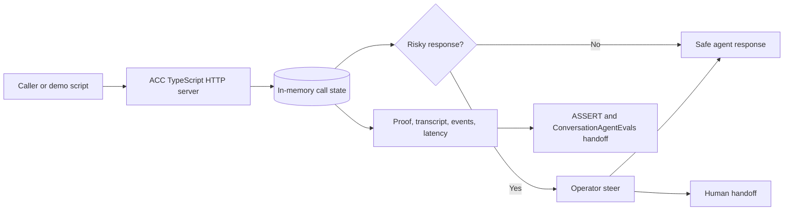

# Agentic Contact Center

Agentic Contact Center is a runnable ClueCon 2026 proof of concept for a safer, operator-steerable voice contact-center flow. It demonstrates a cancellation-rescue call where the realtime loop is owned by the application: the agent can pause at risky policy boundaries, accept operator steer, fail closed to a human handoff, and export reviewable evidence.

The active app is the TypeScript service under `src/`. The older FastAPI/static-web prototype under `apps/` is reference material only.

## Core Value

- Voice-agent demo that keeps control of call state, policy holds, operator decisions, fallback, and evidence.
- Local Pipecat path for the seeded cancellation-rescue scenario, with live telephony and provider credentials mocked.
- Browser caller demo contract for realtime WebRTC into Pipecat, with rtc-asr Local STT v1 and Kokoro TTS preserved as the intended sidecars.
- Operator console for pause/resume, safe-offer approval, takeover, transfer, end-call, fallback drills, notes, queue filters, and proof links.
- QA evidence through transcripts, event trails, latency marks, call snapshots, proof bundles, ASSERT exports, and ConversationAgentEvals-ready handoff artifacts.

## How It Works



The TypeScript service in `src/` owns the HTTP routes, in-memory call state, local Pipecat flow contract, operator steer, fallback, and evidence. `docs/realtime-shim-contract.md` maps the OpenAI Realtime-style web voice lifecycle to the local [`rtc-asr`](https://github.com/agonza1/rtc-asr) / Local STT v1 sidecar contract. The runtime is intentionally local and in-memory; restarting the server clears calls.

## Prerequisites

- Node.js 20 or newer and npm.
- Python 3.11+ for optional Pipecat checks or the local voice bridge.
- Running rtc-asr and Kokoro sidecars for the live browser voice path.
- Optional: `ffmpeg` on `PATH` only for the legacy local WebSocket chunk bridge. The intended browser WebRTC path does not require `ffmpeg` for normal operation.
- Docker and Docker Compose only for containerized commands.

No production credentials are required for the mocked POC. SignalWire, CRM, billing, auth, account access, live telephony, Slack posting, and OpenClaw actions are mocked or represented as deterministic contracts.

## Quick Start

```bash
npm install
npm test
npm start
```

The server listens at `http://localhost:8026` by default. In another terminal, verify health. The health payload separates `demoReady` from `productionReady`; the default POC is demo-ready but production-blocked because telephony, credentials, and state persistence are still local/mocked.

```bash
npm run health:smoke
```

Open `http://localhost:8026/` or `http://localhost:8026/operator/console`, then click **Run Demo Flow** to run the complete mocked call: start call, send seeded caller turns, enter policy hold, approve a safe offer, wrap the call, record disposition, and expose the proof bundle.

Generate reviewable JSON evidence with `npm run proof -- --out artifacts/demo-proof.json --latest-out artifacts/demo-proof-latest.json`.

## Browser WebRTC Voice Readiness

The intended non-SIP browser voice path is:

```text
browser mic -> WebRTC -> Pipecat bridge -> rtc-asr Local STT v1 -> ACC call API -> Kokoro TTS -> WebRTC/browser playback
```

The Issue #213 browser path exposes ACC readiness plus a WebRTC offer/answer proxy into the local Pipecat bridge. Check readiness with:

```bash
curl -fsS http://127.0.0.1:8026/api/browser-webrtc/readiness
npm run browser-webrtc:check -- --url http://127.0.0.1:8026/health
npm run browser-webrtc:live-proof -- --write-template artifacts/browser-webrtc-live-proof/proof.template.json
npm run browser-webrtc:live-proof -- --evidence artifacts/browser-webrtc-live-proof/proof.json --require-review-ready
```

The readiness payload distinguishes ACC contract readiness from live media verification. It reports the Pipecat WebRTC bridge endpoint, rtc-asr, Kokoro, the legacy chunk bridge, and the fact that normal WebRTC browser voice must not require `MediaRecorder` webm chunks or `ffmpeg`. The ACC server proxies browser SDP offers from `POST /api/browser-webrtc/session` to `BROWSER_WEBRTC_BRIDGE_URL` (default `http://127.0.0.1:8766`). Until a local browser proof is attached, `liveMedia.verified=false` and the blocker is `live_webrtc_media_turn_evidence_missing`. The optional `--write-template` command creates the exact JSON event shape reviewers can fill from a real local browser turn before running the review gate, including the current git head so proof is tied to the PR commit under review.

Run the normal browser WebRTC bridge and sidecars in separate terminals:

```bash
export RTC_ASR_BASE_URL=http://127.0.0.1:8080
export RTC_ASR_WS_URL=ws://127.0.0.1:8080/v1/stt/stream
export ASR_VAD_FILTER=false
export KOKORO_BASE_URL=http://127.0.0.1:8880
export BROWSER_WEBRTC_BRIDGE_URL=http://127.0.0.1:8766
npm run pipecat:webrtc:install
npm start
npm run pipecat:webrtc:check
npm run pipecat:webrtc
```

Then open `http://127.0.0.1:8026/operator/console`, click **Connect Voice**, allow browser microphone access, speak one caller turn, wait for the streamed agent audio, click **Copy Proof**, save that JSON under `artifacts/browser-webrtc-live-proof/proof.json`, and run:

```bash
npm run browser-webrtc:live-proof -- --evidence artifacts/browser-webrtc-live-proof/proof.json --require-review-ready
```

## Legacy Local Voice Bridge

The older local voice bridge remains available only as legacy proof plumbing. It records browser webm chunks over a local WebSocket and uses `ffmpeg` for conversion, so it is not the normal browser voice path for Issue #213.

With rtc-asr, Kokoro, and `ffmpeg` already running locally, install and run the legacy bridge in another terminal:

```bash
npm run pipecat:voice:install
npm run pipecat:voice:check
npm run pipecat:voice
```

The legacy audio path is:

```text
browser mic -> MediaRecorder webm chunks -> local Pipecat WebSocket bridge -> ffmpeg -> rtc-asr Local STT v1 -> ACC call API -> Kokoro TTS -> browser playback
```

rtc-asr owns model loading and selection; the legacy bridge reports `stt.engine=rtc-asr` and `tts.engine=kokoro` in ready and turn evidence. Typed caller turns still exercise the same call-flow API when the bridge is not running. See `docs/runtime-reference.md` for sidecar URLs, model notes, and deeper runtime commands.

## ConversationAgentEvals Integration

ACC integrates with [ConversationAgentEvals](https://github.com/agonza1/ConversationAgentEvals) through generated evidence, not an in-process dependency. Normal local demos do not call a ConversationAgentEvals API.

The main handoff file is:

```text
artifacts/agentic-call-center-demo/conversation-agent-evals-assert-request.json
```

It is shaped as an `AssertRunCreateRequest` and includes transcript, conversation, media, action trace, final state, proof bundle, and Local STT evidence pointers.

Generate the handoff bundle:

```bash
npm run proof:pipecat -- --out artifacts/agentic-call-center-demo/source-proof.json --latest-out artifacts/demo-proof-latest.json
npm run proof:bundle -- --proof artifacts/agentic-call-center-demo/source-proof.json --out-dir artifacts/agentic-call-center-demo
```

See `docs/demo-proof-runbook.md` for the proof inspection checklist, local ASSERT workflow, expected artifact set, and ConversationAgentEvals handoff details.

## Useful Routes

- `/`: local demo console.
- `/operator/console`: operator-focused console for queue review, steer, fallback, and proof links.
- `/health`: service/config/runtime readiness.
- `/assert`: ACC local artifact viewer.
- `/assert/full`: wrapper for the upstream ASSERT local viewer.
- `/assert/spec`: editable local eval spec surface.
- `/api/demo/run-end-to-end`: complete seeded demo flow.
- `/api/calls/:callId/proof`: per-call QA proof bundle.

For detailed API route, script, Docker, and local SIP notes, see `docs/runtime-reference.md`.

## Docker

```bash
npm run docker:app
npm run docker:smoke
npm run docker:proof
npm run docker:freeswitch:only
```

Docker exposes the app on port `8026` and includes `/health` checks in both `Dockerfile` and `docker-compose.yml`.

## Project Layout

Active code lives in `src/`, tests in `test/`, proof/runtime scripts in `scripts/`, and deeper context in `docs/`. The legacy prototype remains under `apps/api` and `apps/web`.

## Caveats

- State is in-memory and process-local.
- The local voice bridge uses real local STT/TTS plumbing, but production telephony/provider integrations are mocked.
- `/api/assert/spec` saves the eval spec in memory for the running process; restart resets it to the default.
- `apps/api` and `apps/web` are not covered by the root npm scripts or Docker runtime.
- Local SIP live capture is supported for review workflows; see `docs/freeswitch-local-sip-runbook.md` and `docs/runtime-reference.md` for the current harness and caveats.
