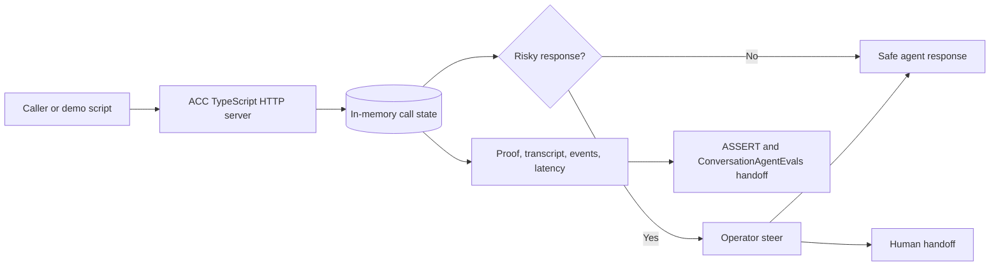

# Agentic Contact Center

Agentic Contact Center is a runnable ClueCon 2026 proof of concept for a safer, operator-steerable voice contact-center flow. It demonstrates a cancellation-rescue call where the realtime loop is owned by the application: the agent can pause at risky policy boundaries, accept operator steer, fail closed to a human handoff, and export reviewable evidence.

The active app is the TypeScript service under `src/`.

## Core Value

- Voice-agent demo that keeps control of call state, policy holds, operator decisions, fallback, and evidence.
- Local Pipecat voice work centered on Issue #222: one shared realtime Pipeline, with browser, fixture/tester, and SIP entering as adapters.
- Browser WebRTC and local SIP/Verto now enter through Pipecat `SmallWebRTCTransport` and the shared rtc-asr -> ACC -> Kokoro Pipeline. The local SIP proof harness captures both the live rtc-asr transcript and non-silent return audio at the caller.
- Operator console for pause/resume, safe-offer approval, takeover, transfer, end-call, fallback drills, notes, queue filters, and proof links.
- QA evidence through transcripts, event trails, latency marks, call snapshots, proof bundles, ASSERT exports, and ConversationAgentEvals-ready handoff artifacts.

## How It Works



The TypeScript service in `src/` owns the HTTP routes, in-memory call state, local Pipecat flow contract, operator steer, fallback, and evidence. The runtime is intentionally local and in-memory; restarting the server clears calls.

## Prerequisites

- Node.js 20 or newer and npm.
- Python 3.11+ for optional Pipecat checks or the local voice bridge.
- Running rtc-asr and Kokoro sidecars for the live browser voice path.
- Docker and Docker Compose only for containerized commands.

No production credentials are required for the mocked POC. SignalWire, CRM, billing, auth, account access, live telephony, and Slack posting are mocked or represented as deterministic contracts.

## Quick Start

```bash
npm install
npm test
npm run docs:validate
npm start
```

The server listens at `http://localhost:8026` by default. In another terminal, verify health. The health payload separates `demoReady` from `productionReady`; the default POC is demo-ready but production-blocked because telephony, credentials, and state persistence are still local/mocked.

```bash
npm run health:smoke
```

Open `http://localhost:8026/` or `http://localhost:8026/operator/console`, then click **Run Demo Flow** to run the complete mocked call: start call, send seeded caller turns, enter policy hold, approve a safe offer, wrap the call, record disposition, and expose the proof bundle.

Generate reviewable JSON evidence with `npm run proof -- --out artifacts/demo-proof.json --latest-out artifacts/demo-proof-latest.json`.

## Shared Media Pipeline Direction

Issue #222 is the architectural center for realtime voice work. The target is one shared Pipecat Pipeline:

```text
transport.input -> rtc-asr STT -> ACC caller-turn adapter -> Kokoro TTS -> transport.output
```

Browser WebRTC, fixture/tester injection, and SIP/FreeSWITCH are adapters into that same Pipeline. Do not add new standalone demo media paths. The browser and Verto bridges use Pipecat `SmallWebRTCTransport` and `build_acc_voice_pipeline()` to run the shared `Pipeline([transport.input(), RtcAsrTurnProcessor, AccCallerTurnProcessor, KokoroTtsProcessor, transport.output()])`. The fixture/tester lane keeps the sidecar-free contract check at `npm run pipecat:fixture:check` and has a live in-process fixture path via `python3 scripts/pipecat-fixture-pipeline-smoke.py --input-wav <mono-pcm16.wav>` when ACC, rtc-asr, and Kokoro are running; omit `--call-id` to have the smoke script start an ACC demo call automatically. The SIP harness at `npm run pipecat:verto:live-proof` sends a real caller WAV through extension `8600` and requires current-call rtc-asr plus non-silent caller-side return audio before reporting `reviewReady: true`.

The remaining #222 acceptance gap is Pipecat Flows/`FlowManager`: cancellation-rescue transitions still live in ACC TypeScript. FlowManager should own the conversation nodes (`call_started`, `greet`, `diagnose`, `policy_hold`, `operator_steer`, `steered_response`, `wrap`) while ACC keeps product state, operator controls, proof artifacts, and queue state.

## Browser WebRTC Voice Readiness

The current non-SIP browser adapter path is:

```text
browser mic -> WebRTC -> Pipecat bridge -> rtc-asr Local STT v1 -> ACC call API -> Kokoro TTS -> WebRTC/browser playback
```

Issue #213 exposes ACC readiness plus a WebRTC offer/answer proxy into the local Pipecat `SmallWebRTCTransport` bridge; #222 owns keeping this adapter and the SIP/fixture adapters on the same shared processor contract. Check readiness with:

```bash
curl -fsS http://127.0.0.1:8026/api/browser-webrtc/readiness
npm run browser-webrtc:check -- --url http://127.0.0.1:8026/health
npm run browser-webrtc:live-proof -- --write-template artifacts/browser-webrtc-live-proof/proof.template.json
npm run browser-webrtc:live-proof -- --evidence artifacts/browser-webrtc-live-proof/proof.json --require-review-ready
```

The readiness payload distinguishes ACC contract readiness from live media verification and reports the Pipecat WebRTC bridge, rtc-asr, and Kokoro separately. The ACC server proxies browser SDP offers from `POST /api/browser-webrtc/session` to `BROWSER_WEBRTC_BRIDGE_URL` (default `http://127.0.0.1:8766`). Until a local browser proof is attached, `liveMedia.verified=false` and the blocker is `live_webrtc_media_turn_evidence_missing`. Passing this route means the executable browser contract is present; full #222 acceptance still requires the FlowManager migration called out above. The optional `--write-template` command creates the exact JSON event shape reviewers can fill from a real local browser turn before running the review gate, including the current git head so proof is tied to the PR commit under review.

Run the normal browser WebRTC bridge and sidecars in separate terminals:

```bash
cd ../rtc-asr
make mlx-venv
env PYTHONPATH=. \
  ASR_BACKEND=parakeet-mlx \
  ASR_DEVICE=apple-silicon \
  ASR_PRELOAD_MODEL=true \
  ASR_PARAKEET_MODEL=mlx-community/parakeet-tdt_ctc-110m \
  ASR_PARAKEET_DTYPE=auto \
  ASR_VAD_FILTER=false \
  .venv-mlx/bin/python -m uvicorn src.main:app --host 127.0.0.1 --port 8080

cd ../agentic-contact-center
export RTC_ASR_BASE_URL=http://127.0.0.1:8080
export RTC_ASR_WS_URL=ws://127.0.0.1:8080/v1/stt/stream
export RTC_ASR_MODEL=mlx-community/parakeet-tdt_ctc-110m
export KOKORO_BASE_URL=http://127.0.0.1:8880
export BROWSER_WEBRTC_BRIDGE_URL=http://127.0.0.1:8766
npm run pipecat:webrtc:install
npm start
npm run pipecat:webrtc:check
npm run pipecat:webrtc
```

Then open `http://127.0.0.1:8026/operator/console`, click **Connect Voice**, allow browser microphone access, speak one caller turn, wait for the streamed agent audio, click **Copy Proof**, save that JSON under `artifacts/browser-webrtc-live-proof/proof.json`, and run:

```bash
npm run browser-webrtc:live-proof -- --evidence artifacts/browser-webrtc-live-proof/proof.json --require-review-ready
```

## ConversationAgentEvals Integration

ACC integrates with [ConversationAgentEvals](https://github.com/agonza1/ConversationAgentEvals) through generated evidence, not an in-process dependency. Normal local demos do not call a ConversationAgentEvals API.

The main handoff file is:

```text
artifacts/agentic-call-center-demo/conversation-agent-evals-assert-request.json
```

It is shaped as an `AssertRunCreateRequest` and includes transcript, conversation, media, action trace, final state, proof bundle, and Local STT evidence pointers.

Generate the handoff bundle:

```bash
npm run proof:pipecat -- --out artifacts/agentic-call-center-demo/source-proof.json --latest-out artifacts/demo-proof-latest.json
npm run proof:bundle -- --proof artifacts/agentic-call-center-demo/source-proof.json --out-dir artifacts/agentic-call-center-demo
```

Generate a shared-pipeline tester-agent handoff for CAE/ASSERT:

```bash
npm run cae:assert:handoff -- --out-dir artifacts/cae-assert-handoff
```

That writes `conversation-agent-evals-assert-request.json`, a CAE prefill template, requirements/scenario/timeline/final-state/verdict artifacts, and explicit failure-mode notes. ConversationAgentEvals owns the generic editable spec UI and ASSERT run UX; ACC only supplies domain defaults and evidence pointers.

See `docs/demo-proof-runbook.md` for the proof inspection checklist, local ASSERT workflow, expected artifact set, and ConversationAgentEvals handoff details.

## Useful Routes

- `/`: local demo console.
- `/operator/console`: operator-focused console for queue review, steer, fallback, and proof links.
- `/health`: service/config/runtime readiness.
- `/assert`: ACC local artifact viewer.
- `/assert/full`: wrapper for the upstream ASSERT local viewer.
- `/assert/spec`: editable local eval spec surface.
- `/api/demo/run-end-to-end`: complete seeded demo flow.
- `/api/calls/:callId/proof`: per-call QA proof bundle.

For detailed API route, script, Docker, and local SIP notes, see `docs/runtime-reference.md`.

## Docker

```bash
npm run docker:app
npm run docker:smoke
npm run docker:proof
npm run docker:voice
npm run docker:browser-webrtc
npm run docker:freeswitch:only
npm run docker:sip-verto
npm run docker:sip
npm run docker:assert
npm run docker:full
```

Docker exposes the app on port `8026` and includes `/health` checks in both `Dockerfile` and `docker-compose.yml`. The default app/proof commands stay small. Optional Compose profiles add the local contact-center sidecars:

- `voice`: rtc-asr on `8080` and Kokoro on `8880`.
- `browser-webrtc`: voice sidecars plus the Pipecat browser WebRTC bridge on `8766`.
- `sip-verto`: FreeSWITCH, rtc-asr, Kokoro, and the preferred Pipecat Verto/WebRTC agent-leg bridge for extension `8600`.
- `sip`: legacy FreeSWITCH-to-ACC ESL proof/debug bridge with rtc-asr and Kokoro.
- `eval`: ASSERT artifact export/viewer on `5174`.
- `full`: all optional local services for an end-to-end lab stack.

The `rtc-asr` service defaults to the local image name `rtc-asr:local`; build it from the sibling `rtc-asr` checkout or override `RTC_ASR_IMAGE` before starting a voice profile. Override `KOKORO_IMAGE` if a different Kokoro FastAPI image is preferred.

## Project Layout

Active code lives in `src/`, tests in `test/`, proof/runtime scripts in `scripts/`, and deeper context in `docs/`.

## Caveats

- State is in-memory and process-local.
- The browser voice bridge uses Pipecat `SmallWebRTCTransport` plus the shared `Pipeline`, but live browser proof still requires local rtc-asr, Kokoro, and browser playback evidence.
- `/api/assert/spec` saves the eval spec in memory for the running process; restart resets it to the default.
- Local SIP `8600` targets a FreeSWITCH-owned Verto/WebRTC agent leg (`acc-pipecat`) as the preferred #222 route. Use `npm run pipecat:verto:live-proof` to require caller PCM entering Pipecat, a current-call rtc-asr final transcript, Kokoro TTS completion, and non-silent caller-side return audio from that same active call.
