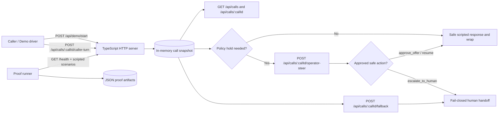

# Agentic Contact Center

Current GitHub implementation track for the ClueCon 2026 POC lane.

The active scaffold is the TypeScript HTTP server under `src/`. It now covers:

- config-backed `GET /health`
- mocked telephony ingress bootstrap at `POST /api/demo/start`
- in-memory caller transcript append at `POST /api/calls/:callId/caller-turn`
- current call snapshot lookup at `GET /api/calls/:callId`
- lightweight transcript polling at `GET /api/calls/:callId/transcript` with optional `?speaker=caller`, `?since=...&until=...`, `?text=renewal`, `?offset=0&limit=25`, and `?order=desc`; reversed time windows return `transcript_window_invalid`
- filterable event-trail evidence at `GET /api/calls/:callId/events` with optional `?type=caller_turn_appended`, `?source=mock_http_route`, `?since=...`, `?offset=0&limit=25` (limit max 100), and `?order=desc` for newest-first lightweight QA and operator audit polling; event summaries include the latest filtered event, the last event returned by the current page, and `summary.page.nextOffset` for cursor-style polling
- filterable latency-mark evidence at `GET /api/calls/:callId/latency` with optional `?stage=caller_turn_received`, `?overBudget=false`, `?offset=0&limit=25` (limit max 100), and `?order=desc` so QA can poll timing proof without fetching the full call snapshot
- active call index lookup at `GET /api/calls` with optional `?flowState=policy_hold`, `?pendingOperatorSteer=true`, `?fallbackArmed=true`, `?attentionRequired=true`, `?attentionSource=operator_steer`, `?attentionReason=pipecat%20tool%20exceeded%20latency%20budget`, `?providerCallId=mock-sw-call-001-0001`, `?openclawSessionId=openclaw-call-0001`, `?openclawSessionLabel=cluecon-demo/demo-call-0001`, `?openclawSessionRef=...` filtering when the operator only has a single OpenClaw session handle, `?minAttentionAgeMs=30000` filtering for stale attention, `?sort=attentionStartedAt` ordering to put the oldest operator-attention item first, `?order=desc` to reverse the current sort for newest-first polling, and `?offset=1` plus `?limit=1` payload windowing for lightweight polling with `summary.page` pagination metadata, plus both global queue totals and a filter-scoped `summary.filteredSummary` block with oldest-attention metadata including provider and OpenClaw session id/label references, queue age in milliseconds, exact attention start timestamps, flow state, and the current attention reason/source
- queue-only operator summary lookup at `GET /api/queue` so the demo can poll counts and oldest-attention metadata without fetching every call snapshot, with the same optional `flowState`, `pendingOperatorSteer`, `fallbackArmed`, `attentionRequired`, `attentionSource`, `attentionReason`, provider-call, OpenClaw session, and stale-attention filters as `GET /api/calls` for scoped operator polling, including `oldestAttentionAgeMs` for simple stale-queue detection
- deterministic Pipecat-style flow state, policy hold behavior, operator-steer control, and tool coverage in the live call snapshot
- OpenClaw-style per-call session envelope plus seeded latency/event trail visibility in the live call snapshot

## Run locally

```bash
npm install
npm test
npm run proof -- --out artifacts/demo-proof.json --latest-out artifacts/demo-proof-latest.json
npm start
```

The server listens on `http://localhost:8026` by default. With the server running in a managed background process, use `npm run health:smoke` for a bounded `/health` probe instead of treating the attached start command as the verification result. The probe retries until the outer timeout expires, aborts hanging `/health` responses instead of waiting on a stuck socket forever, and can assert expected `demoName`, `mode`, `provider`, `policyProfile`, `policyToolScope`, `operatorChannel`, `fallbackMode`, or one or more named `runtimeSeams`, Pipecat readiness with `--expect-pipecat-ready true`, scripted-flow completion with `--expect-pipecat-script-completed true`, Pipecat tool coverage such as `--expect-pipecat-tool goto_slide`, or latency budgets such as `--expect-latency-budget-ms asrPartial=350` and maximum budget ceilings such as `--expect-latency-budget-max-ms asrPartial=350` with repeatable `--expect-*` flags during QA handoff. Metadata assertion failures now print both the expected and actual values for faster triage.

## High-level flow



The mock runtime keeps one operator-visible call snapshot with session ids, transcript turns, flow-state transitions, operator steer status, fallback rationale, and latency marks for QA handoff.

## Run with Docker Compose

Start the local API container:

```bash
npm run docker:app
npm run docker:smoke
```

`npm run docker:smoke` starts the container in the background, only runs the probe after `docker compose up --build -d app` succeeds, polls `http://localhost:8026/health` with a bounded retry loop, and always tears the Compose app back down after the probe. The runtime image also carries a built-in Docker `HEALTHCHECK` so `docker run` and Compose both expose the same `/health` readiness signal.

## Seeded cancellation-rescue script

Post these caller turns in order to exercise the deterministic issue `#4` prototype:

1. `I want to cancel my policy today.`
2. `The renewal increase is too high.`
3. `Okay, what safe options can you review for me?`
4. `Thanks, please note that follow-up and close the call.`

The prototype will pause at `policy_hold` before any risky retention offer and then resume with a safe deterministic response that never promises a billing credit by default.

## Proof Runner

Run the text-first proof harness to execute the critical demo flows and save both a reviewable artifact and a stable latest pointer:

```bash
npm run proof -- --out artifacts/demo-proof.json --latest-out artifacts/demo-proof-latest.json
```

The command:

- runs the seeded scripted path through policy hold, operator steer, and wrap
- runs the fail-closed `tool_timeout` fallback path
- writes JSON proof output with transcript, event trail, and latency marks for both scenarios
- adds a top-level `schemaVersion` plus `proofContract` block so reviewers can tell which outcomes, event types, and queue filter the artifact proves
- adds a top-level `summary` block so reviewers can inspect outcomes, turn counts, fallback reason, event types, and latency stages quickly
- optionally refreshes a stable latest artifact path for QA handoff or PR review attachments

If `--out` is omitted, the proof file is written to `artifacts/demo-proof-<timestamp>.json`. Add `--latest-out artifacts/demo-proof-latest.json` to keep a deterministic handoff file updated alongside timestamped runs.

To generate the proof artifact through Compose instead of the host Node toolchain:

```bash
npm run docker:proof
```

That writes `artifacts/demo-proof-docker.json` plus a refreshed `artifacts/demo-proof-latest.json` on the host. The script passes the caller UID/GID through to Compose by default so the bind-mounted artifact files stay owned by the invoking developer on Linux instead of root.

For a step-by-step QA handoff flow, artifact inspection checklist, and example commands, use [docs/demo-proof-runbook.md](docs/demo-proof-runbook.md).

## Current slice status

- CUE-001: scaffold and architecture baseline merged in PR `#9`
- CUE-002 / issue `#3`: implemented on PR `#10` with mocked telephony ingress and in-memory call session bootstrap
- CUE-003 / issue `#4`: implemented in merged PR `#12` with deterministic Pipecat-style flow state, safe policy hold behavior, and live tool coverage
- CUE-004 / issue `#5`: implemented in merged PR `#13` with mock OpenClaw session metadata, ordered event trail visibility, and seeded latency marks
- CUE-005 / issue `#6`: implemented with a mocked `POST /api/calls/:callId/operator-steer` path with Slack-style pause/resume/goto-slide/ask operations plus safe approve/escalate outcomes
- CUE-006 / issue `#7`: implemented with `POST /api/calls/:callId/fallback`, `tool_timeout` fail-closed handling, explicit fallback rationale in `GET /api/calls/:callId`, and proof/test coverage for safe human escalation
- CUE-007 / issue `#8`: implemented with `npm run proof`, serializable JSON evidence for scripted and fallback paths, and a repo-local QA runbook for reproducible handoff

## Note on legacy prototype

`apps/api/` and `apps/web/` contain an older local FastAPI demo prototype. They are useful reference material, but they are not the authoritative implementation status for the current GitHub issue sequence.
