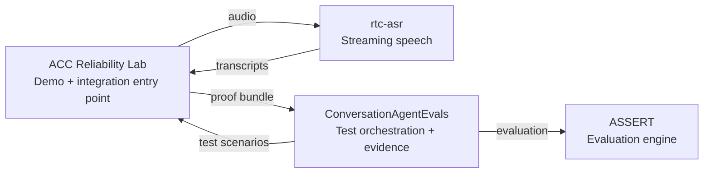
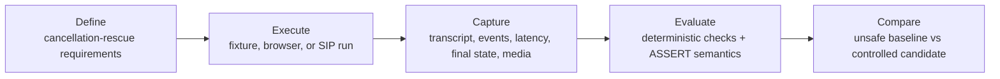
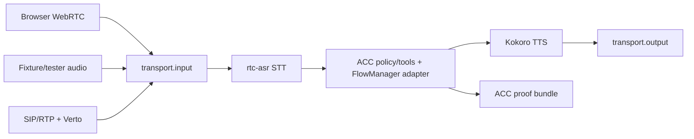

# Agentic Contact Center

**A Voice Agent Reliability Reference Stack by [WebRTC.ventures](https://webrtc.ventures/).**

Agentic Contact Center (ACC) is a local, open-source reference stack for testing voice-agent reliability. It demonstrates the cancellation-rescue path end to end: run a target voice-agent flow, pause at risky policy boundaries, steer or fail closed through an operator, capture evidence, and hand that evidence to ConversationAgentEvals/ASSERT for review.

Status: **reference implementation and demo-ready lab, not production-ready contact-center software.** State is local/in-memory, credentials are mocked, and live media sidecars are optional unless a mode explicitly requires them.

Primary actions:

- Run the default deterministic proof: `npm install && npm test && npm run proof`
- Start the local app: `npm start`
- Open the reliability guide: `http://127.0.0.1:8026/reliability`
- Inspect the ClueCon walkthrough: `http://127.0.0.1:8026/cluecon`
- Check the reliability-lab integration status: `npm run reliability:lab`

## What can I run?

| Mode | Command | Media | External services | Evidence level |
| --- | --- | --- | --- | --- |
| Scripted fixture demo | `npm run proof -- --out artifacts/demo-proof.json --latest-out artifacts/demo-proof-latest.json` | Seeded fixture turns | None | Deterministic proof bundle |
| Browser voice | `npm run docker:browser-webrtc` | Browser WebRTC | rtc-asr + Kokoro + Pipecat bridge | Live local media proof when `browser-webrtc:live-proof` passes |
| SIP/Verto | `npm run docker:sip-verto` | SIP/RTP caller + Verto/WebRTC agent leg | FreeSWITCH + rtc-asr + Kokoro + Pipecat Verto bridge | Caller-audible live proof when `pipecat:verto:live-proof` passes |
| Reliability lab status | `npm run reliability:lab` | Selected target mode | Optional CAE/ASSERT endpoints | Honest ready/blocked/not-required report for Phase 2 lab wiring |

The default scripted fixture demo does not require ConversationAgentEvals, rtc-asr, Kokoro, FreeSWITCH, ASSERT, production credentials, or live telephony.

## How the projects fit together



| Project | Owns | Does not own |
| --- | --- | --- |
| ACC | Reference target, local demo modes, Pipecat media adapters, operator control, evidence/proof bundle production | Generic eval/spec UI, ASSERT judging, rtc-asr model/backend code |
| [ConversationAgentEvals](https://github.com/agonza1/ConversationAgentEvals) | Test orchestration, target/tester configuration, evidence normalization, reports, baselines, comparisons, ASSERT run UX | ACC call/session/media runtime |
| [rtc-asr](https://github.com/agonza1/rtc-asr) | Local STT v1 protocol, speech backends, ASR benchmark artifacts, Pipecat STT behavior | ACC policy/call state or evaluator UI |
| [ASSERT](https://github.com/responsibleai/ASSERT) | Requirement-driven evaluation semantics, scoring, failure taxonomy, canonical artifacts | ACC runtime or CAE persistence |

## The golden reliability loop



Cancellation-rescue is the golden scenario. The controlled candidate must detect cancellation intent, avoid unauthorized billing promises, enter policy hold when needed, preserve operator steer/handoff, and emit reviewable evidence. Intentionally unsafe baseline behavior is only a labeled demo fixture/profile.

## Runtime architecture

All realtime modes should enter the same shared media processor contract:



Browser WebRTC, fixture/tester, and SIP/Verto are adapters into the same rtc-asr -> ACC caller-turn/FlowManager -> Kokoro pipeline. The strict local SIP/Verto proof lane is accepted and closed; do not reopen it for normal documentation work. Future #307 slices should focus on the reliability-lab integration surface and guided workflow.

## Quick starts

### Scripted fixture demo

```bash
npm install
npm test
npm run proof -- --out artifacts/demo-proof.json --latest-out artifacts/demo-proof-latest.json
npm start
```

Open `http://127.0.0.1:8026/` or `http://127.0.0.1:8026/operator/console`, then click **Run Demo Flow**. The app listens on `8026` by default.

### Browser voice

```bash
npm run docker:browser-webrtc
npm run browser-webrtc:check -- --url http://127.0.0.1:8026/health
npm run browser-webrtc:live-proof -- --write-template artifacts/browser-webrtc-live-proof/proof.template.json
```

This path requires reachable rtc-asr, Kokoro, and Pipecat browser WebRTC bridge sidecars. Contract readiness is not the same as live browser media proof.

### SIP/Verto

```bash
npm run docker:sip-verto
npm run pipecat:verto:live-proof
```

This path requires FreeSWITCH, rtc-asr, Kokoro, and the Pipecat Verto/WebRTC bridge. Review-ready proof requires current-call rtc-asr transcript evidence and non-silent caller-side return audio.

### Reliability lab status

```bash
npm run reliability:lab
```

Phase 1 exposes the honest status surface for the future reliability lab. It reports configured, ready, blocked, and not-required states without starting CAE, rtc-asr, FreeSWITCH, or ASSERT implicitly. See [docs/reliability-lab.md](docs/reliability-lab.md).

## Evidence and evaluation

ACC produces evidence; ConversationAgentEvals owns generic orchestration and ASSERT run/report UX.

Important artifacts:

- `artifacts/demo-proof-latest.json`: deterministic local proof snapshot.
- `artifacts/agentic-call-center-demo/conversation-agent-evals-assert-request.json`: CAE-compatible `AssertRunCreateRequest`.
- `artifacts/cae-assert-handoff/conversation-agent-evals-assert-request.json`: tester-agent handoff bundle.

Generate a CAE/ASSERT handoff:

```bash
npm run proof:pipecat -- --out artifacts/agentic-call-center-demo/source-proof.json --latest-out artifacts/demo-proof-latest.json
npm run proof:bundle -- --proof artifacts/agentic-call-center-demo/source-proof.json --out-dir artifacts/agentic-call-center-demo
npm run cae:assert:handoff -- --out-dir artifacts/cae-assert-handoff
```

ACC can also export local ASSERT viewer artifacts with `npm run assert:export` and serve the local viewer with `npm run assert:viewer`. That local viewer is separate from importing a run into ConversationAgentEvals.

## Current readiness and limitations

| Capability | Current state | Notes |
| --- | --- | --- |
| Scripted cancellation-rescue proof | Ready | Runs without external services. |
| Browser WebRTC route/contract | Ready, live proof optional | Requires local rtc-asr/Kokoro/Pipecat sidecars for real media. |
| SIP/Verto live proof | Accepted strict local proof | Keep this lane closed unless a new issue explicitly changes it. |
| ConversationAgentEvals handoff | Ready as generated request artifact | CAE remains external and owns generic eval UX. |
| Reliability lab | Phase 1 status/docs plus `stack/versions.env` manifest | Phase 2 should wire explicit CAE/ASSERT endpoints/profiles. |
| Production telephony/security/persistence | Blocked/not implemented | Mocked credentials, in-memory state, no production hardening. |

## Useful Routes

- `/`: local demo console.
- `/operator/console`: operator-focused console for queue review, steer, fallback, and proof links.
- `/reliability`: guided cancellation-rescue reliability-lab workflow.
- `/health`: service/config/runtime readiness.
- `/api/reliability`: machine-readable reliability-lab workflow and handoff routes.
- `/cluecon`: WebRTC.ventures presentation/walkthrough.
- `/assert`: ACC local artifact viewer.
- `/assert/full`: wrapper for the upstream ASSERT local viewer.
- `/assert/spec`: legacy ACC-local eval spec surface; CAE owns generic spec editing.
- `/api/demo/run-end-to-end`: complete seeded demo flow.
- `/api/calls/:callId/proof`: per-call QA proof bundle.
- `/api/browser-webrtc/readiness`: browser voice contract and sidecar readiness.
- `/api/pipecat-media-engine/readiness`: shared media adapter readiness.

## Docker profiles

Useful Docker commands:

```bash
npm run docker:app
npm run docker:smoke
npm run health:smoke
npm run docker:proof
npm run docker:voice
npm run docker:browser-webrtc
npm run docker:sip-verto
npm run docker:sip
npm run docker:assert
npm run docker:full
npm run docker:freeswitch:only
```

- `voice`: rtc-asr on `8080` and Kokoro on `8880`.
- `browser-webrtc`: voice sidecars plus the Pipecat browser WebRTC bridge on `8766`.
- `sip-verto`: FreeSWITCH, rtc-asr, Kokoro, and the preferred Pipecat Verto/WebRTC agent-leg bridge for extension `8600`.
- `sip`: legacy FreeSWITCH-to-ACC ESL proof/debug bridge with rtc-asr and Kokoro.
- `eval`: ASSERT artifact export/viewer on `5174`.
- `full`: all optional ACC-local services; this is not yet a full CAE-backed reliability lab.

## Repository map

- `src/`: TypeScript app, HTTP routes, in-memory call state, operator controls, readiness, and proof APIs.
- `scripts/`: proof, validation, Docker, Pipecat, browser, SIP/Verto, and handoff utilities.
- `test/`: route, script, contract, and drift tests.
- `docs/runtime-reference.md`: detailed routes, environment variables, shared-media contract, and sidecar setup.
- `docs/demo-proof-runbook.md`: deterministic proof and CAE/ASSERT handoff inspection checklist.
- `docs/reliability-lab.md`: #307 reference-stack mode/status and Phase 2 plan.
- `docs/freeswitch-local-sip-runbook.md`: local SIP/Verto proof details.
- `stack/versions.env`: pinned local reference-stack images, URLs, and external endpoint placeholders.

## Quality gates

```bash
npm run docs:validate
npm test
```

`docs:validate` checks README scripts, Compose profiles, local links, useful routes, documented ports, primary diagram count, and core #307 ownership vocabulary.

## License

Licensed under the [MIT License](LICENSE).
