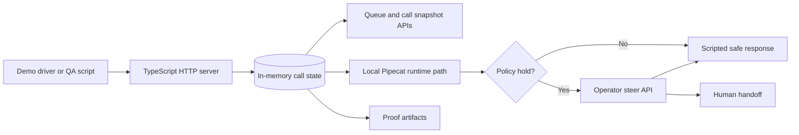

# Agentic Contact Center

Runnable proof of concept for a ClueCon 2026 contact-center demo. The current implementation is a TypeScript HTTP service with a local Pipecat runtime path for the seeded cancellation-rescue call, mocked telephony/provider boundaries, operator steer, transcript/event/latency evidence, and fail-closed human handoff.

The authoritative app for the current work is under `src/`. The older FastAPI/static-web prototype under `apps/` is still useful reference material, but it is not the active runtime described below.

## What It Demonstrates

- Mock telephony ingress for starting calls and appending caller turns.
- Local Pipecat runtime mode for the seeded cancellation-rescue path, with provider credentials and live telephony mocked.
- Policy hold before risky retention responses.
- Slack-style operator steer commands such as pause, resume, approve offer, jump slide, ask operator, arm fallback, and escalate.
- Fail-closed fallback for `tool_timeout` and `runtime_failure` paths.
- Operator/QA evidence through call snapshots, queue summaries, transcript pages, event trails, latency marks, and proof artifacts.

## Architecture



Main components:

- `src/index.ts` starts the Node HTTP server on `PORT` or `8026`.
- `src/http/createServer.ts` defines the JSON API routes.
- `src/core/inMemoryTelephonyIngress.ts` owns call state, transcript turns, queue summaries, fallback state, and evidence.
- `src/core/pipecatFlowPrototype.ts` exposes the local Pipecat runtime contract, seeded script behavior, and supported tool coverage.
- `src/config/loadPocConfig.ts` loads `config/poc.config.example.json`.
- `scripts/demo-proof.mjs` runs the scripted and fallback scenarios and writes JSON proof.
- `scripts/health-smoke.mjs` polls `/health` and can assert expected metadata.
- `docs/realtime-shim-contract.md` maps the OpenAI Realtime-style web voice lifecycle to the local `rtc-asr` / Local STT v1 sidecar contract.

The runtime is intentionally local and in-memory. Restarting the server clears calls.

## Prerequisites

- Node.js 20 or newer.
- npm.
- Docker and Docker Compose, only if you want the containerized commands.
- Python 3.11+ for `npm run pipecat:check` or if you are exploring the legacy `apps/api` prototype.

## Configuration

The Node server reads `config/poc.config.example.json` from the repo root by default. Set `POC_CONFIG_PATH` to point at another JSON config file. It must include:

- `demoName` and `mode`
- `provider.name` and `provider.callId`
- `policy.profile`, `policy.toolScope`, `policy.defaultSupervisorSteer`, and `policy.fallbackMode`
- `operator.channel`
- `latencyBudgetsMs`

Environment variables:

- `PORT`: optional HTTP port for `npm start`; defaults to `8026`.
- `POC_CONFIG_PATH`: optional path to a JSON config file; defaults to `config/poc.config.example.json`.
- `LOCAL_UID` / `LOCAL_GID`: optional Docker proof runner ownership override for Linux bind-mounted artifacts.

There is no `.env` file in the current Node app, and no production credentials are required for the mocked POC. The active runtime reports `pipecat_local_runtime` in `/health`, call snapshots, and proof artifacts; `/health` also names the local `npm run pipecat:check` verification command. SignalWire, CRM, billing, auth, and live telephony remain mocked.

## Install

```bash
npm install
```

Optional Pipecat local-runtime check:

```bash
python3 -m pip install --target .pipecat-runtime -r requirements-pipecat.txt
npm run pipecat:check
```

This verifies the local `pipecat-ai` package boundary only. It does not open microphones, start live telephony, or use provider credentials.

## Run Locally

Build and test first:

```bash
npm test
```

Start the server:

```bash
npm start
```

The server listens at `http://localhost:8026` by default. In another terminal, verify health:

```bash
npm run health:smoke
```

Useful health assertions:

```bash
npm run health:smoke -- \
  --expect-demo-name cluecon-2026-cancellation-rescue \
  --expect-mode mocked_telephony \
  --expect-provider signalwire \
  --expect-pipecat-ready true \
  --expect-pipecat-prototype-mode pipecat_local_runtime \
  --expect-pipecat-transport local_process \
  --expect-pipecat-runtime-engine pipecat-ai \
  --expect-pipecat-credentials-mode mocked \
  --expect-pipecat-runtime-check-command "npm run pipecat:check" \
  --expect-pipecat-runtime-check-live-telephony-required false \
  --expect-pipecat-active-tool get_current_slide \
  --expect-pipecat-tool goto_slide
```

## Run with Docker

Start the app container:

```bash
npm run docker:app
```

Run a build, start the app in the background, probe `/health`, and tear it down:

```bash
npm run docker:smoke
```

Generate proof artifacts through Compose:

```bash
npm run docker:proof
```

Docker exposes the app on `8026` and includes a `/health` healthcheck in both `Dockerfile` and `docker-compose.yml`.

## Demo Flow

Seeded caller turns for the cancellation-rescue script:

1. `I want to cancel my policy today.`
2. `The renewal increase is too high.`
3. `Okay, what safe options can you review for me?`
4. `Thanks, please note that follow-up and close the call.`

The flow enters `policy_hold` before unsafe retention offers, requests operator steer, and resumes only after a safe action such as `approve_offer`. The fallback path accepts `tool_timeout` and `runtime_failure` modes to arm a fail-closed human handoff.

## API Overview

- `GET /health`: service/config/runtime readiness.
- `POST /api/demo/start`: create a mocked call session.
- `POST /api/signalwire/events`: exercise the local SignalWire bridge contract for `call.started`, `media.transcript`, `call.ended`, and fail-closed `call.error` events without production credentials.
- `POST /api/calls/:callId/caller-turn`: append a caller transcript turn and advance the flow.
- `POST /api/calls/:callId/operator-steer`: apply operator commands or direct actions, including pause/resume, approval, takeover, escalation, and safe call closeout.
- `POST /api/calls/:callId/operator-note`: record operator notes and optional dispositions into the transcript and proof event trail.
- `POST /api/calls/:callId/fallback`: trigger demo fallback with `tool_timeout` or `runtime_failure`.
- `GET /api/calls`: list active calls with optional queue/operator filters.
- `GET /api/queue`: return queue summary metadata without full call payloads.
- `GET /api/operator/actions`: expose the Slack-ready operator action catalog with command examples, reason/pending-call requirements, HTTP body templates, and outcome hints for console buttons.
- `GET /api/realtime-shim/proof`: expose deterministic Gateway relay and Local STT v1 evidence for the mocked realtime shim path.
- `GET /api/realtime-shim/readiness`: summarize Issue #85 acceptance readiness, adapter shape, browser relay compatibility, mocked pieces, and limitations from the proof evidence.
- `POST /api/realtime-shim/rpc`: exercise the `talk.session.*` Gateway relay RPC boundary with persistent local shim session state, including `talk.session.cancelInput` input-buffer cancellation, `talk.session.recordError` bounded Local STT failure evidence, and read-only `talk.session.getEvidence` QA snapshots.
- `GET /api/calls/:callId`: fetch the current call snapshot.
- `GET /api/calls/:callId/transcript`: fetch filterable transcript pages.
- `GET /api/calls/:callId/events`: fetch filterable event evidence, including detail-text search for QA audits.
- `GET /api/calls/:callId/latency`: fetch filterable latency evidence.
- `GET /api/calls/:callId/artifacts`: fetch the OpenClaw artifact manifest for the call, including linked evidence routes and latest evidence counters.
- `GET /api/calls/:callId/proof`: export a per-call QA proof bundle with transcript, events, operator decisions, runtime mode, latency, fallback/handoff state, OpenClaw artifact links, and demo PII assumptions.

Local SignalWire bridge exercise:

```bash
curl -s -X POST http://localhost:8026/api/signalwire/events \
  -H 'content-type: application/json' \
  -d '{"eventType":"call.started","signalWireCallId":"sw-demo-1"}'

curl -s -X POST http://localhost:8026/api/signalwire/events \
  -H 'content-type: application/json' \
  -d '{"eventType":"media.transcript","signalWireCallId":"sw-demo-1","text":"I want to cancel my policy today."}'
```

The local bridge treats SignalWire as the telephony entrypoint while keeping credentials mocked and persists the SignalWire call id as `providerCallId` for queue lookup/filtering. `call.error` routes to the existing `tool_timeout` fallback/human handoff path, and `call.ended` safely closes the demo call. Demo recording and consent remain explicit operator responsibilities before connecting real callers.

Common list/queue filters include `callId`, `providerCallId`, `flowState`, `pipecatActiveTool`, `pendingOperatorSteer`, `fallbackArmed`, `attentionRequired`, `attentionSource`, `attentionReason`, `openclawSessionId`, `openclawSessionLabel`, `openclawSessionRef`, `transcriptText`, `minAttentionAgeMs`, `maxAttentionAgeMs`, `latencyStage`, `latencyOverBudget`, `fallbackMode` (`tool_timeout` or `runtime_failure`), `fallbackReason`, and `fallbackSource` such as `tool_timeout_fail_closed`.

Call, transcript, event, and latency routes support pagination with `offset`, `limit`, and `order=asc|desc`. Event trails also support `detailKey` and `detailText` filters for scoped QA proof lookups. Their max page size is `100`.

Minimal manual exercise:

```bash
curl -s -X POST http://localhost:8026/api/demo/start \
  -H 'content-type: application/json' \
  -d '{"openclawSessionLabel":"manual-demo"}'
```

Use the returned `session.callId` in follow-up calls:

```bash
curl -s -X POST http://localhost:8026/api/calls/<callId>/caller-turn \
  -H 'content-type: application/json' \
  -d '{"text":"I want to cancel my policy today."}'

curl -s http://localhost:8026/api/calls/<callId>
```

## Proof Runner

Generate reviewable JSON evidence:

```bash
npm run proof -- --out artifacts/demo-proof.json --latest-out artifacts/demo-proof-latest.json
```

The proof runner builds the TypeScript app, starts the server on an ephemeral port, checks `/health`, and collects per-call evidence that matches the same bundle shape exposed by `GET /api/calls/:callId/proof`. It runs:

- the scripted cancellation path through policy hold, operator steer, and wrap
- the fail-closed `tool_timeout` fallback path; the API route also accepts `runtime_failure` for local Pipecat runtime failure drills
- queue and evidence lookups used by QA

If `--out` is omitted, the artifact is written to `artifacts/demo-proof-<timestamp>.json`. `--latest-out` keeps a stable pointer for handoff. Use `npm run proof:pipecat -- --out artifacts/demo-proof.json --latest-out artifacts/demo-proof-latest.json` when you want the Pipecat package self-check to gate the proof run. See [docs/demo-proof-runbook.md](docs/demo-proof-runbook.md) for the QA inspection checklist.

Generate realtime shim issue #85 proof evidence:

```bash
npm run proof:realtime-shim -- --out artifacts/realtime-shim-proof.json
```

The realtime shim proof starts the compiled app on an ephemeral port, fetches `GET /api/realtime-shim/proof`, asserts the issue #85 readiness summary, and writes the Gateway relay/Local STT v1 evidence payload for review.

Generate a ConversationAgentEvals-ready proof bundle with media artifacts:

```bash
npm run proof:pipecat -- --out artifacts/agentic-call-center-demo/source-proof.json --latest-out artifacts/demo-proof-latest.json
npm run proof:bundle -- --proof artifacts/agentic-call-center-demo/source-proof.json --out-dir artifacts/agentic-call-center-demo
```

The bundle writes `proof-bundle-manifest.json`, `conversation-agent-evals-assert-request.json`, transcript/action/final-state files, a seeded local WAV caller capture, SVG operator-console screenshots, an animated GIF recording, and Local STT v1 framing evidence for the `rtc-asr` boundary. It remains local and mocked: live telephony and provider credentials are not used. Set `RTC_ASR_WS_URL=ws://127.0.0.1:8080/v1/stt/stream` for a later live local `rtc-asr` sidecar run.

## Scripts

- `npm run build`: compile TypeScript to `dist/`.
- `npm test`: build and run Node tests from `dist/test/*.test.js`.
- `npm start`: run the compiled server from `dist/src/index.js`.
- `npm run proof`: build and run `scripts/demo-proof.mjs`.
- `npm run proof:realtime-shim`: build and write the issue #85 realtime shim proof artifact.
- `npm run pipecat:check`: verify the local `pipecat-ai` runtime package boundary without live telephony.
- `npm run proof:pipecat`: run `pipecat:check` before the proof harness.
- `npm run proof:bundle`: convert a proof JSON file into a ConversationAgentEvals-ready evidence bundle with media artifacts.
- `npm run health:smoke`: poll `http://127.0.0.1:8026/health`.
- `npm run docker:app`: build and run the Docker app service in the foreground.
- `npm run docker:smoke`: run a bounded Docker health probe and clean up.
- `npm run docker:proof`: run the proof harness in Compose and write artifacts.

## Project Layout

```text
.
├── config/                  # Example POC runtime config
├── docs/                    # Architecture notes and proof runbook
├── scripts/                 # Proof and health smoke scripts
├── src/                     # Active TypeScript HTTP POC
│   ├── config/              # Config loading
│   ├── core/                # In-memory flow/session/evidence logic
│   └── http/                # JSON route handlers
├── test/                    # Node test suite for active TypeScript app
├── apps/api/                # Legacy FastAPI prototype
├── apps/web/                # Legacy static prototype UI
├── Dockerfile
└── docker-compose.yml
```

## Caveats

- State is in-memory and process-local.
- Telephony, OpenClaw, Pipecat, Slack, CRM, billing, and authentication are mocked or represented as deterministic contracts.
- `apps/api` and `apps/web` are not covered by the root npm scripts or Docker runtime.

## FreeSWITCH and Local SIP Live Capture

This repo now has a local SIP live-capture path for workboard card `872af947-ef57-47bd-a4f3-3750f54e1948`. It does not require or store production SignalWire credentials.

Quick local harness self-test, marked `generated_media` and not review-ready:

```sh
npm run build
PORT=8026 npm start
npm run sip:self-test -- --acc-url http://127.0.0.1:8026
npm run proof:live-sip-bundle -- --live-manifest artifacts/local-sip-selftest/local-sip-live-proof-manifest.json --out-dir artifacts/local-sip-selftest-bundle
```

FreeSWITCH local SIP target:

- SIP account: `1000` / `local-sip-pass` at `127.0.0.1:5060` UDP
- Dial: `8600`
- ESL bridge: `npm run freeswitch:bridge -- --acc-url http://127.0.0.1:8026`
- Docker profile: `npm run docker:freeswitch` when Docker is available
- Runbook: `docs/freeswitch-local-sip-runbook.md`

Review release requires a real local SIP softphone call with `live_capture`, not the generated self-test. If `RTC_ASR_WS_URL` is not set, the bundle emits an explicit `rtc_asr_blocked` artifact and blocker instead of a fake transcript.

The operator/demo UI for this path is `/operator/console`. Select the live SIP call to see the visible run/session id, SIP/FreeSWITCH/SignalWire runtime labels, audio WAV and SIP log paths, live transcript or rtc-asr blocker state, proof/eval links, caveats, and operator controls for fallback, takeover, transfer, or end-call handoff.
