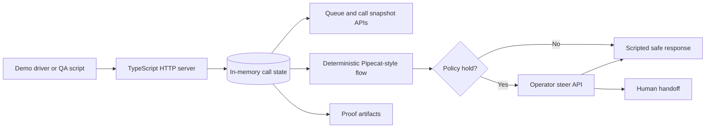

# Agentic Contact Center

Runnable proof of concept for a ClueCon 2026 contact-center demo. The current implementation is a TypeScript HTTP service that simulates a cancellation-rescue call, pauses at policy-sensitive moments, accepts operator steer, records transcript/event/latency evidence, and can fail closed to a human handoff.

The authoritative app for the current work is under `src/`. The older FastAPI/static-web prototype under `apps/` is still useful reference material, but it is not the active runtime described below.

## What It Demonstrates

- Mock telephony ingress for starting calls and appending caller turns.
- Deterministic Pipecat-style flow state for a cancellation rescue path.
- Policy hold before risky retention responses.
- Slack-style operator steer commands such as pause, resume, approve offer, jump slide, ask operator, arm fallback, and escalate.
- Fail-closed fallback for a `tool_timeout` path.
- Operator/QA evidence through call snapshots, queue summaries, transcript pages, event trails, latency marks, and proof artifacts.

## Architecture



Main components:

- `src/index.ts` starts the Node HTTP server on `PORT` or `8026`.
- `src/http/createServer.ts` defines the JSON API routes.
- `src/core/inMemoryTelephonyIngress.ts` owns call state, transcript turns, queue summaries, fallback state, and evidence.
- `src/core/pipecatFlowPrototype.ts` exposes the deterministic flow contract and supported tool coverage.
- `src/config/loadPocConfig.ts` loads `config/poc.config.example.json`.
- `scripts/demo-proof.mjs` runs the scripted and fallback scenarios and writes JSON proof.
- `scripts/health-smoke.mjs` polls `/health` and can assert expected metadata.

The runtime is intentionally local and in-memory. Restarting the server clears calls.

## Prerequisites

- Node.js 20 or newer.
- npm.
- Docker and Docker Compose, only if you want the containerized commands.
- Python 3.11+ only if you are exploring the legacy `apps/api` prototype.

## Configuration

The Node server reads `config/poc.config.example.json` from the repo root by default. Set `POC_CONFIG_PATH` to point at another JSON config file. It must include:

- `demoName` and `mode`
- `provider.name` and `provider.callId`
- `policy.profile`, `policy.toolScope`, `policy.defaultSupervisorSteer`, and `policy.fallbackMode`
- `operator.channel`
- `latencyBudgetsMs`

Environment variables:

- `PORT`: optional HTTP port for `npm start`; defaults to `8026`.
- `POC_CONFIG_PATH`: optional path to a JSON config file; defaults to `config/poc.config.example.json`.
- `LOCAL_UID` / `LOCAL_GID`: optional Docker proof runner ownership override for Linux bind-mounted artifacts.

There is no `.env` file in the current Node app, and no production credentials are required for the mocked POC.

## Install

```bash
npm install
```

## Run Locally

Build and test first:

```bash
npm test
```

Start the server:

```bash
npm start
```

The server listens at `http://localhost:8026` by default. In another terminal, verify health:

```bash
npm run health:smoke
```

Useful health assertions:

```bash
npm run health:smoke -- \
  --expect-demo-name cluecon-2026-cancellation-rescue \
  --expect-mode mocked_telephony \
  --expect-provider signalwire \
  --expect-pipecat-ready true \
  --expect-pipecat-tool goto_slide
```

## Run with Docker

Start the app container:

```bash
npm run docker:app
```

Run a build, start the app in the background, probe `/health`, and tear it down:

```bash
npm run docker:smoke
```

Generate proof artifacts through Compose:

```bash
npm run docker:proof
```

Docker exposes the app on `8026` and includes a `/health` healthcheck in both `Dockerfile` and `docker-compose.yml`.

## Demo Flow

Seeded caller turns for the cancellation-rescue script:

1. `I want to cancel my policy today.`
2. `The renewal increase is too high.`
3. `Okay, what safe options can you review for me?`
4. `Thanks, please note that follow-up and close the call.`

The flow enters `policy_hold` before unsafe retention offers, requests operator steer, and resumes only after a safe action such as `approve_offer`. The fallback path uses `tool_timeout` to arm a fail-closed human handoff.

## API Overview

- `GET /health`: service/config/runtime readiness.
- `POST /api/demo/start`: create a mocked call session.
- `POST /api/calls/:callId/caller-turn`: append a caller transcript turn and advance the flow.
- `POST /api/calls/:callId/operator-steer`: apply operator commands or direct actions.
- `POST /api/calls/:callId/fallback`: trigger demo fallback, currently centered on `tool_timeout`.
- `GET /api/calls`: list active calls with optional queue/operator filters.
- `GET /api/queue`: return queue summary metadata without full call payloads.
- `GET /api/operator/actions`: expose the Slack-ready operator action catalog with command examples and reason/pending-call requirements.
- `GET /api/calls/:callId`: fetch the current call snapshot.
- `GET /api/calls/:callId/transcript`: fetch filterable transcript pages.
- `GET /api/calls/:callId/events`: fetch filterable event evidence, including detail-text search for QA audits.
- `GET /api/calls/:callId/latency`: fetch filterable latency evidence.
- `GET /api/calls/:callId/proof`: export a per-call QA proof bundle with transcript, events, operator decisions, runtime mode, latency, fallback/handoff state, OpenClaw artifact links, and demo PII assumptions.

Common list/queue filters include `callId`, `providerCallId`, `flowState`, `pipecatActiveTool`, `pendingOperatorSteer`, `fallbackArmed`, `attentionRequired`, `attentionSource`, `attentionReason`, `openclawSessionId`, `openclawSessionLabel`, `openclawSessionRef`, `transcriptText`, `minAttentionAgeMs`, `maxAttentionAgeMs`, `latencyStage`, and `latencyOverBudget`.

Call, transcript, event, and latency routes support pagination with `offset`, `limit`, and `order=asc|desc`. Their max page size is `100`.

Minimal manual exercise:

```bash
curl -s -X POST http://localhost:8026/api/demo/start \
  -H 'content-type: application/json' \
  -d '{"openclawSessionLabel":"manual-demo"}'
```

Use the returned `session.callId` in follow-up calls:

```bash
curl -s -X POST http://localhost:8026/api/calls/<callId>/caller-turn \
  -H 'content-type: application/json' \
  -d '{"text":"I want to cancel my policy today."}'

curl -s http://localhost:8026/api/calls/<callId>
```

## Proof Runner

Generate reviewable JSON evidence:

```bash
npm run proof -- --out artifacts/demo-proof.json --latest-out artifacts/demo-proof-latest.json
```

The proof runner builds the TypeScript app, starts the server on an ephemeral port, checks `/health`, and collects per-call evidence that matches the same bundle shape exposed by `GET /api/calls/:callId/proof`. It runs:

- the scripted cancellation path through policy hold, operator steer, and wrap
- the fail-closed `tool_timeout` fallback path
- queue and evidence lookups used by QA

If `--out` is omitted, the artifact is written to `artifacts/demo-proof-<timestamp>.json`. `--latest-out` keeps a stable pointer for handoff. See [docs/demo-proof-runbook.md](docs/demo-proof-runbook.md) for the QA inspection checklist.

## Scripts

- `npm run build`: compile TypeScript to `dist/`.
- `npm test`: build and run Node tests from `dist/test/*.test.js`.
- `npm start`: run the compiled server from `dist/src/index.js`.
- `npm run proof`: build and run `scripts/demo-proof.mjs`.
- `npm run health:smoke`: poll `http://127.0.0.1:8026/health`.
- `npm run docker:app`: build and run the Docker app service in the foreground.
- `npm run docker:smoke`: run a bounded Docker health probe and clean up.
- `npm run docker:proof`: run the proof harness in Compose and write artifacts.

## Project Layout

```text
.
├── config/                  # Example POC runtime config
├── docs/                    # Architecture notes and proof runbook
├── scripts/                 # Proof and health smoke scripts
├── src/                     # Active TypeScript HTTP POC
│   ├── config/              # Config loading
│   ├── core/                # In-memory flow/session/evidence logic
│   └── http/                # JSON route handlers
├── test/                    # Node test suite for active TypeScript app
├── apps/api/                # Legacy FastAPI prototype
├── apps/web/                # Legacy static prototype UI
├── Dockerfile
└── docker-compose.yml
```

## Caveats

- State is in-memory and process-local.
- Telephony, OpenClaw, Pipecat, Slack, CRM, billing, and authentication are mocked or represented as deterministic contracts.
- `apps/api` and `apps/web` are not covered by the root npm scripts or Docker runtime.
