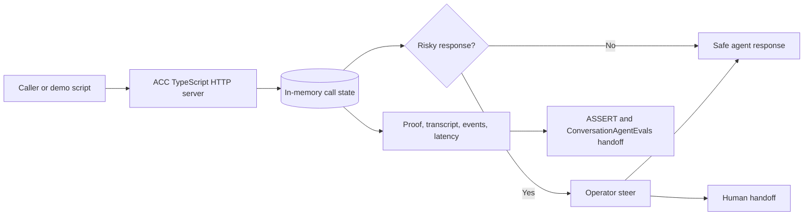

# Agentic Contact Center

Agentic Contact Center is a runnable ClueCon 2026 proof of concept for a safer, operator-steerable voice contact-center flow. It demonstrates a cancellation-rescue call where the realtime loop is owned by the application: the agent can pause at risky policy boundaries, accept operator steer, fail closed to a human handoff, and export reviewable evidence.

The active app is the TypeScript service under `src/`. The older FastAPI/static-web prototype under `apps/` is reference material only.

## Core Value

- Voice-agent demo that keeps control of call state, policy holds, operator decisions, fallback, and evidence.
- Local Pipecat path for the seeded cancellation-rescue scenario, with live telephony and provider credentials mocked.
- Browser caller demo using microphone audio, a local Pipecat WebSocket bridge, MLX Whisper STT, and macOS `say` TTS.
- Operator console for pause/resume, safe-offer approval, takeover, transfer, end-call, fallback drills, notes, queue filters, and proof links.
- QA evidence through transcripts, event trails, latency marks, call snapshots, proof bundles, ASSERT exports, and ConversationAgentEvals-ready handoff artifacts.

## How It Works



The TypeScript service in `src/` owns the HTTP routes, in-memory call state, local Pipecat flow contract, operator steer, fallback, and evidence. `docs/realtime-shim-contract.md` maps the OpenAI Realtime-style web voice lifecycle to the local `rtc-asr` / Local STT v1 sidecar contract. The runtime is intentionally local and in-memory; restarting the server clears calls.

## Prerequisites

- Node.js 20 or newer and npm.
- Python 3.11+ for optional Pipecat checks or the local voice bridge.
- `ffmpeg` on `PATH` for local voice bridge audio conversions.
- macOS `say` for the current local TTS path.
- Docker and Docker Compose only for containerized commands.

No production credentials are required for the mocked POC. SignalWire, CRM, billing, auth, account access, live telephony, Slack posting, and OpenClaw actions are mocked or represented as deterministic contracts.

## Quick Start

```bash
npm install
npm test
npm start
```

The server listens at `http://localhost:8026` by default. In another terminal, verify health. The health payload separates `demoReady` from `productionReady`; the default POC is demo-ready but production-blocked because telephony, credentials, and state persistence are still local/mocked.

```bash
npm run health:smoke
```

Open `http://localhost:8026/` or `http://localhost:8026/operator/console`, then click **Run Demo Flow** to run the complete mocked call: start call, send seeded caller turns, enter policy hold, approve a safe offer, wrap the call, record disposition, and expose the proof bundle.

Generate reviewable JSON evidence with `npm run proof -- --out artifacts/demo-proof.json --latest-out artifacts/demo-proof-latest.json`.

## Local Voice Demo

Install and run the voice bridge in a second terminal:

```bash
npm run pipecat:voice:install
npm run pipecat:voice
```

Then open `http://localhost:8026/`, use **Pipecat Voice Caller**, click **Connect Voice**, allow microphone access, and speak naturally. The audio path is:

```text
browser mic -> local Pipecat bridge -> MLX Whisper local STT -> ACC call API -> macOS say TTS -> browser playback
```

The first voice turn may download the configured MLX Whisper model. Typed caller turns still exercise the same call-flow API when the bridge is not running. See `docs/runtime-reference.md` for model overrides and deeper runtime commands.

## ConversationAgentEvals Integration

ACC integrates with [ConversationAgentEvals](https://github.com/agonza1/ConversationAgentEvals) through generated evidence, not an in-process dependency. Normal local demos do not call a ConversationAgentEvals API.

The main handoff file is:

```text
artifacts/agentic-call-center-demo/conversation-agent-evals-assert-request.json
```

It is shaped as an `AssertRunCreateRequest` and includes transcript, conversation, media, action trace, final state, proof bundle, and Local STT evidence pointers.

Generate the handoff bundle:

```bash
npm run proof:pipecat -- --out artifacts/agentic-call-center-demo/source-proof.json --latest-out artifacts/demo-proof-latest.json
npm run proof:bundle -- --proof artifacts/agentic-call-center-demo/source-proof.json --out-dir artifacts/agentic-call-center-demo
```

See `docs/demo-proof-runbook.md` for the proof inspection checklist, local ASSERT workflow, expected artifact set, and ConversationAgentEvals handoff details.

## Useful Routes

- `/`: local demo console.
- `/operator/console`: operator-focused console for queue review, steer, fallback, and proof links.
- `/health`: service/config/runtime readiness.
- `/assert`: ACC local artifact viewer.
- `/assert/full`: wrapper for the upstream ASSERT local viewer.
- `/assert/spec`: editable local eval spec surface.
- `/api/demo/run-end-to-end`: complete seeded demo flow.
- `/api/calls/:callId/proof`: per-call QA proof bundle.

For detailed API route, script, Docker, and local SIP notes, see `docs/runtime-reference.md`.

## Docker

```bash
npm run docker:app
npm run docker:smoke
npm run docker:proof
npm run docker:freeswitch:only
```

Docker exposes the app on port `8026` and includes `/health` checks in both `Dockerfile` and `docker-compose.yml`.

## Project Layout

Active code lives in `src/`, tests in `test/`, proof/runtime scripts in `scripts/`, and deeper context in `docs/`. The legacy prototype remains under `apps/api` and `apps/web`.

## Caveats

- State is in-memory and process-local.
- The local voice bridge uses real local STT/TTS plumbing, but production telephony/provider integrations are mocked.
- `/api/assert/spec` saves the eval spec in memory for the running process; restart resets it to the default.
- `apps/api` and `apps/web` are not covered by the root npm scripts or Docker runtime.
- Local SIP live capture is supported for review workflows; see `docs/freeswitch-local-sip-runbook.md` and `docs/runtime-reference.md` for the current harness and caveats.
